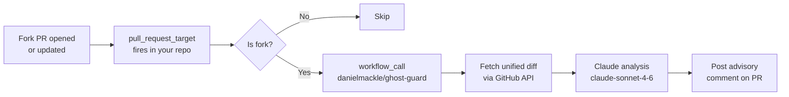

[](https://github.com/danielmackle/ghost-guard/blob/main/.github/workflows/claude.yml)
[](https://anthropic.com)
[](https://github.com/danielmackle/ghost-guard)

When a contributor forks your Puppet module repo and opens a PR, Ghost Guard fetches the unified diff and asks Claude to assess whether it is safe to trigger acceptance tests. It posts a structured advisory comment on the PR — a human reviewer reads it and decides. Nothing is blocked automatically.

## How it works



> Fork code is never checked out or executed. The scan reads only the unified diff text via the GitHub API.

## Adding Ghost Guard to your repo

### 1. Add the caller workflow

Create `.github/workflows/ghost-guard.yml` in your Puppet module repo:

```yaml
name: Ghost Guard

on:
  pull_request_target:
    types: [opened, synchronize, reopened]

jobs:
  ghost-guard:
    if: github.event.pull_request.head.repo.fork == true
    uses: danielmackle/ghost-guard/.github/workflows/claude.yml@main
    with:
      pr_number: ${{ github.event.pull_request.number }}
      repo: ${{ github.repository }}
    secrets:
      anthropic_api_key: ${{ secrets.ANTHROPIC_API_KEY }}
```

> **Use `pull_request_target`, not `pull_request`.** Only `pull_request_target` has access to repo secrets for fork PRs. The `if:` condition ensures the scan only runs on fork PRs — internal branch PRs are skipped.

### 2. Add the API key secret

**Settings → Secrets and variables → Actions → New repository secret**

| Name | Value |
|---|---|
| `ANTHROPIC_API_KEY` | Your Anthropic API key |

`GITHUB_TOKEN` is provided automatically — no configuration needed.

## Sample output

Ghost Guard posts a comment like this on every scanned fork PR:

---

**Ghost Guard Advisory Scan**

**Risk:** ⚠️ Needs scrutiny before running tests

**Summary:** New repository fixture pointing to an external, unverified GitHub repo that will be cloned during test runs

**Findings:**
- `.fixtures.yml:7–9` — A new repositories entry pulls code from an unverified third-party GitHub repo at a mutable ref (`main`). During acceptance tests this repo will be cloned and its code executed in CI, giving it access to secrets.

> Advisory only — not a substitute for human review. This scan helps assess whether it is safe to trigger acceptance tests on this fork PR.

---

The comment is updated in place on each new push to the PR — one comment per PR, always current.

## Risk levels

| Level | When |
|---|---|
| ✅ No concerns | No suspicious changes; routine updates |
| 🟡 Minor | Touches a high-scrutiny file but the change is clearly explainable |
| ⚠️ Needs scrutiny | Ambiguous — verify before triggering acceptance tests |
| 🚨 High | Clear indicators: secret access, network exfiltration, backdoor, source redirect |

## High-scrutiny files

| File | Risk vector |
|---|---|
| `spec/**` | RSpec hooks that read `ENV` and exfiltrate values |
| `spec/spec_helper.rb` | Runs before every test — the most common exfiltration point |
| `Gemfile` | Malicious or typosquatted gems that execute on `bundle install` or `require` |
| `Rakefile` | Code that runs on `require` or during test tasks |
| `.fixtures.yml` | Module source URLs redirected to attacker-controlled repos |
| `.github/**` | Workflow steps that directly access secrets |
| `CODEOWNERS` | Removal of legitimate reviewers |
| `metadata.json` | Source URL changes |

## Requirements

- `ANTHROPIC_API_KEY` secret in your repo's Actions secrets
- GitHub-hosted runner (`ubuntu-latest`) — Ruby stdlib is used, no extra gems needed
- This repo must remain **public** for cross-repo `workflow_call` to work

## Security properties

- Fork code is never checked out or executed
- `pull_request_target` runs in the base repo context — secrets are safe
- The scan is advisory only — it never blocks a merge or prevents tests from running
